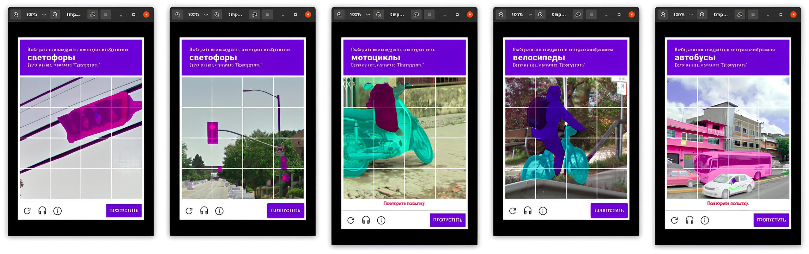
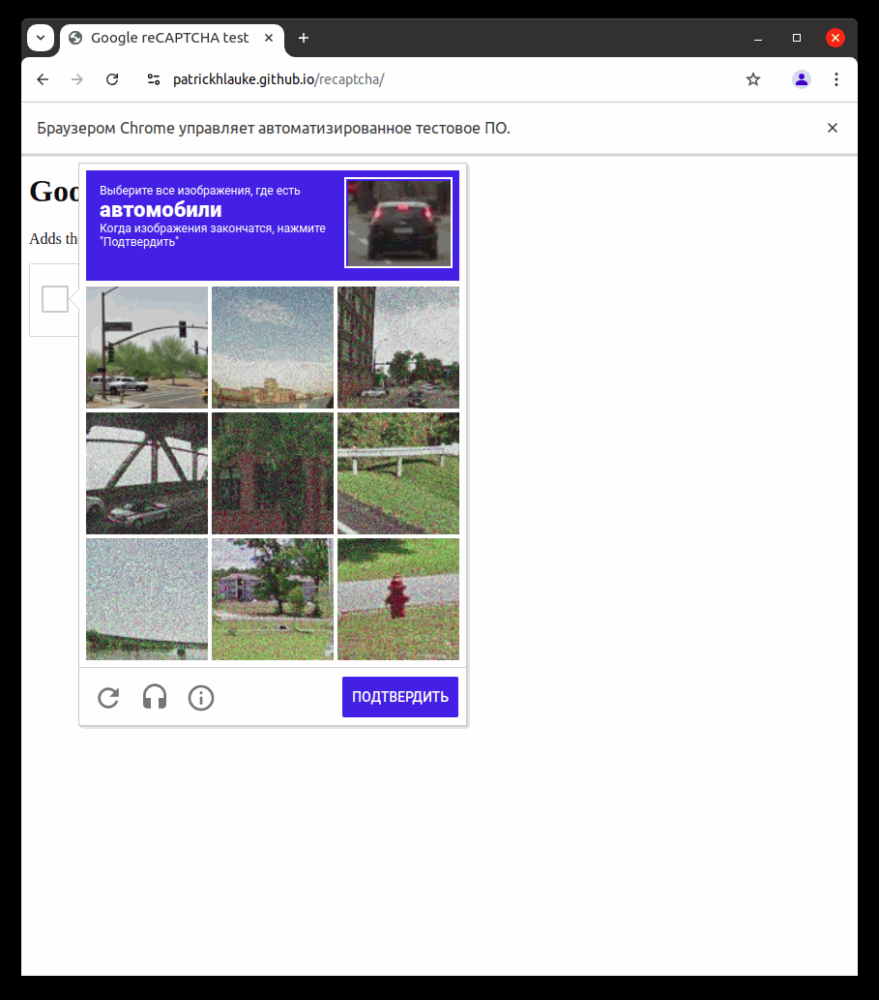

# ReCaptcher ⚡⚡⚡

ReCaptcher - Automatic Google reCAPTCHAv2 Solver using YOLO Model Segmentation.

The most accurate visual Google captcha solver at the moment, using not detection of objects in the captcha, but segmentation. 
Which makes the solution of captchas several times more accurate and faster.

Please use for educational purposes only :)
* Solve Google reCAPTCHAv2 in Russian 🇷🇺 and English 🇺🇸;
* Solve dynamic (where new images appear after selection) and one-time reCAPTCHA;
* Customize the wait time between each stage of solving the captcha. From mega fast solutions to super slow ones;
* Use any modern YOLO segmentation models.



## Project Description

ReCaptcher uses Selenium to automatically interact with the web page that hosts reCAPTCHA and the **YOLO segmentation model**,
which allows it to efficiently recognize and process elements of this captcha.

YOLO performs segmentation and returns object masks,
then the received masks are analyzed to find intersections between them and the captcha cells.
Based on the received intersection data, the system decides which cells with objects should be selected.

An example of an automatic Google reCAPTCHA solution is presented below.



## Installing requirements

   ```bash
  git clone https://github.com/yaroslavorl/ReCaptcher.git
  cd ReCaptcher
  
  # Python >= 3.10
  python -m venv venv
  source venv/bin/activate
   
  pip install -r requirements.txt
```

## Installing Chromedriver

To work with Selenium you need to install Chromedriver of your Google Chrome version

#### Useful links:

1. [Установка браузер Chrome и Chromedriver Ubuntu 20.04](https://skolo.online/documents/webscrapping/#step-2-install-chromedriver)
2. [Chromedriver GitHub](https://github.com/dreamshao/chromedriver)
3. https://www.selenium.dev/documentation/webdriver/

## Demo

```python
import time

from utils.get_driver import get_driver
from solver import CaptchaSolver


def main():
  captcha_page = "https://www.google.com/recaptcha/api2/demo"

  driver_path = '/path/to/chromedriver'
  google_driver = get_driver(driver_path)
  google_driver.implicitly_wait(5)
  google_driver.get(captcha_page)

  solver = CaptchaSolver(google_driver, detector_weight='yolo_weights/yolov9e-seg.pt')

  time.sleep(2)
  # These lines are enough to automatically solve Google captcha.
  if solver.is_captcha():
    solver.solve_captcha()

  google_driver.quit()


if __name__ == '__main__':
  main()
```

### Recaptcher Settings:
`TIME_SLEEP` — is a class that manages the time delays when interacting with elements on a web page with a captcha. Below are the parameters that you can configure for the captcha solver to work:
```python
from solver import CaptchaSolver
from config.settings import TimeSleep

# Setting the wait time after any stage of solving the captcha
TIME_SLEEP = TimeSleep(CLICK_IM_NOT_ROBOT=2, # Time (in seconds) to wait before clicking the "I'm not a robot" button.
                       CLICK_RATE=0.1, # Delay between cell clicks.
                       CLICK_ON_CELL_DONE=1, # Waiting time after successful completion of the challenge.
                       SKIP_CAPTCHA=2, # Wait time after skipping captcha.
                       CAPTCHA_COMPLETED=1, # Wait time after successfully completing a captcha.
                       ADDITIONAL_CHALLENGE=10 # Waiting time for new objects to appear on a dynamic captcha.
                       )

# Selection of YOLO-seg scales (YOLOv8-seg/YOLOv9-seg/YOLOv11-seg)
DETECTOR_WEIGHT = 'yolov9e-seg.pt'

solver = CaptchaSolver(driver=google_driver,
                       times_sleep=TIME_SLEEP,
                       detector_weight=DETECTOR_WEIGHT)

if solver.is_captcha():
    solver.solve_captcha()
```
### Solver Settings:
```python 
def solve_captcha(
        self,
        *,
        click_im_not_robot: bool = True,
        is_img_blur: bool = True,
        ksize_blur: tuple[int, int] = (11, 11),
        sigma_blur: float = 1,
        binary_cell_thresh: float = 254,
        area_cell_thresh: float = 5e3,
        error_similar_area: float = 250,
        detect_confidence: float = 0.05,
        mask_cell_overlap_px: int = 5
) -> bool:
  """
   Method for automatically solving captcha.

   Args:
      click_im_not_robot (bool): If True, simulates a click on the "I'm not a robot" button.
      is_img_blur (bool): If True, applies blur to the captcha image.
      ksize_blur (tuple[int, int]): Size of the blur kernel.
      sigma_blur (float): The sigma value for the Gaussian blur.
      binary_cell_thresh (float): Threshold value for captcha cell binarization.
      area_cell_thresh (float): Threshold area for defining captcha cells.
      error_similar_area (float): Acceptable area error for similar captcha cells.
      detect_confidence (float): Confidence level when solving a captcha.
      mask_cell_overlap_px (int): Number of mask pixels overlapped by the cell.

   Returns:
      (bool): True, if the captcha was successfully solved
   """
```

## Limitations
 ReCaptcher has been tested on five captcha sites, however unexpected errors may still occur.
#### Results may vary depending on:
* The number of requests sent from your IP address;
* Internet connection quality;
* WebDriver settings (eg low time_wait when searching for elements);
* Setting time_sleep between stages of interaction with a web page;
* The web page where the captcha is located - elements may have different paths, names, etc.
* Changes made by developers to the html code of sites with the searched elements (a new setting of paths to elements in settings will be required);
* Captcha language, because the project was originally created for solving Russian captchas. However, you have the opportunity to solve captchas in English, but errors are possible.
